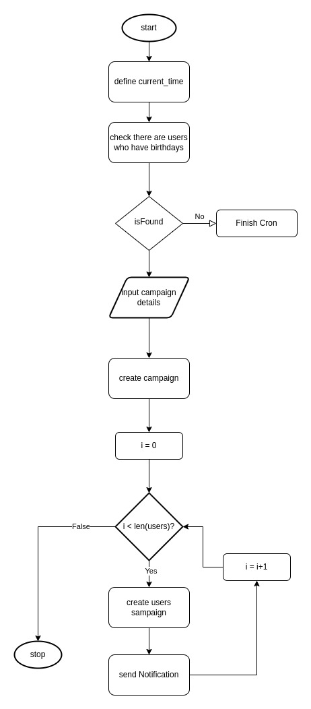

# Voucher System

Proyek voucher sistem adalah sebuah aplikasi web yang menyediakan API untuk pembelian produk

## Pencegahan Keamanan

Langkah pencegahan
1. **Validasi Input**: melakukan validasi parameter

2. **Perlindungan Terhadap Serangan Injection**: menggunakan parameterized queries atau prepared statements saat berinteraksi dengan basis data untuk mencegah SQL Injection.
3. **Autentikasi**: menerapkan autentikasi yang kuat menggunakan token JWT (JSON Web Tokens)

# Flow chart
ada 2 flow chart utama untuk sistem ini, yaitu :

## buy produk


## generate birthday voucher



# Rancangan Database
rancangan dan relasi database digambarkan sebagai berikut


## Documentation

[Penjelasan Flow Sistem](https://gist.github.com/arifkurniawan200/d8f5009da804c2079318d21eae23eebf)


## Running System

change app.yaml.example in folder config to app.yaml and setting the configuration based on your machine

install dependencies

```bash
  go mod tidy
```

running database migration (create table and seed data into the table)

```bash
  go run main.go db:migrate up
```


reset database (delete database and existing data)

```bash
  go run main.go db:migrate reset
```

running api server

```bash
  go run main.go api
```


## Tech Stack

**Database:** MySQL

**Framework:** Echo golang

**Migration:** Goose
## API Reference

#### login as admin

```http
  GET /login
  
  param :
  email: arifkurniawandev96@gmail.com
  password: secure_password
```

#### register user

```http
  GET /register
  
  param :
  email: {{username}}
  password: {{password}}
```

### login user
```http
  GET /login
  
  param :
  email: {{username}}
  password: {{password}}
```

### Authorization

To Access endpoint always using bearer Authorization

```
Bearer {{token from login}}
```


#### example operation

postman file already attached in repo

